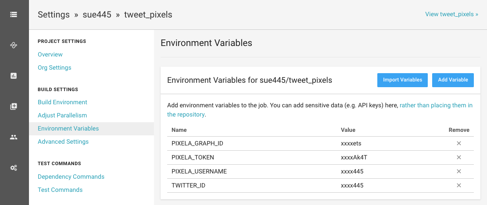

# Tweet pixels
[](https://pixe.la/v1/users/sue445/graphs/tweets.html)

[](https://circleci.com/gh/sue445/tweet_pixels/tree/master)

## Features
* Regularly update the graph of tweet count. (daily and hourly)

## Requirements
* [Pixela](https://pixe.la/)
* [Twilog](https://twilog.org/)

## Usage
### 1. Register Pixela and create graph
e.g)

```bash
cp .env.example .env
vi .env
bundle install --path=vendor/bundle

./bin/console
```

```ruby
# register
@client.create_user(agree_terms_of_service: true, not_minor: true)

# create graph
@graph.create(name: "Daily tweets", unit: "Tweets", type: "int", color: "sora")
```

### 2. Register Environment Variables to CircleCI
* `TWITTER_ID`
* `PIXELA_USERNAME`
* `PIXELA_TOKEN`
* `PIXELA_GRAPH_ID`



### 3. Register a GitHub cache url (optional)
Register a GitHub cache url (e.g. `https://camo.githubusercontent.com/xxxxxxxxxx`) after paste a badge to GitHub

e.g)

```ruby
@graph.update(purge_cache_urls: "https://camo.githubusercontent.com/xxxxxxxxxx")
```

see https://github.com/a-know/Pixela/releases/tag/v1.1.0
